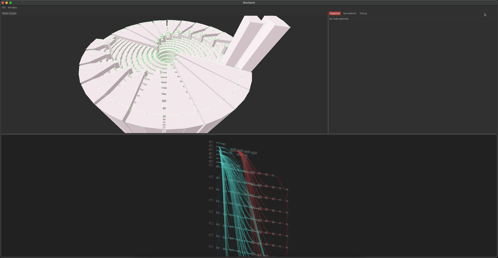

# go-bjk

go-bjk is a Go library used to generate `*.bjk` input files for
the node-based parametric modeling program called "Blackjack":
https://github.com/setzer22/blackjack

## Examples

With [Go](https://go.dev) already installed, clone the repo, then type:

```bash
./run.sh
```

This program will generate a file called "bifilar-electromagnet.bjk" which,
when opened with `blackjack_ui`, will look something like this:

[]
